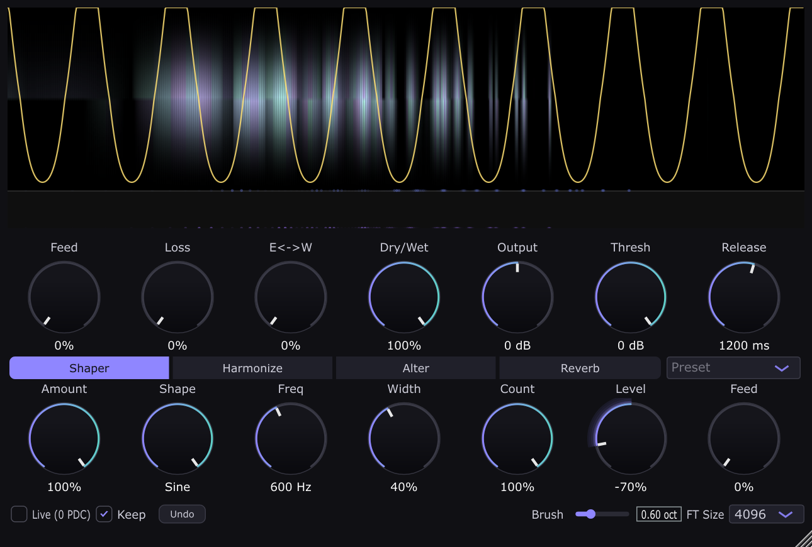
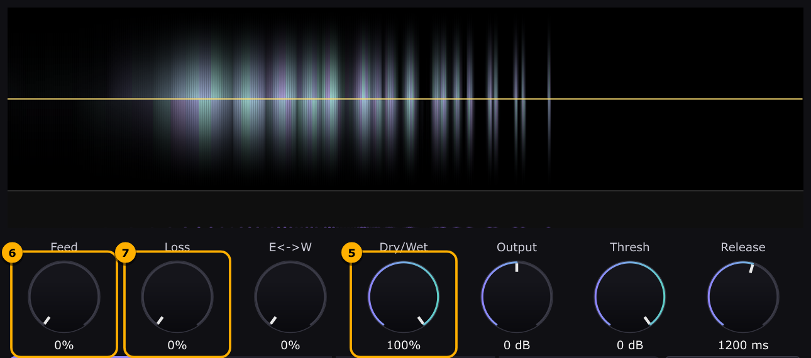

# Spectral Hold

A spectral freeze / hold effect: VST3 and Standalone on Linux, macOS and Windows, plus
CLAP on Linux. Spectral Hold keeps playing whatever you feed into it. It doesn't loop a
grain. Each FFT bin is a free-running oscillator that keeps going after the input stops,
so held sounds are continuous tones with no loop seam. You can then reshape, transpose,
harmonize and reverberate the held sound while it plays.



**📖 [User manual](docs/MANUAL.md)**: every control, how it is meant to be used, with
pictures.

## Getting started

1. Set **Feed** to 0, then turn **Loss** up until the plugin is silent. This empties the
   hold.
2. Turn **Loss** back to 0.
3. Play some sound into the plugin and raise **Feed** a bit. The display fills as the
   sound is captured.
4. Set **Dry/Wet** to 100%, **Feed** to 0 and **Loss** to 0. The sound is now frozen and
   keeps ringing on its own.
5. Play with the knobs to tweak the running sound: the Shaper, the brush (click on the
   display), Transpose, Harmonize, Reverb…



The [manual's Getting started](docs/MANUAL.md#1-getting-started) walks through these
steps with a picture for each.

## Install

Download the zip for your OS from
[Releases](https://github.com/autotel/Spectral-hold-plugin/releases). Copy
`Spectral Hold.vst3` into your VST3 folder:

| OS      | VST3 folder                            |
|---------|----------------------------------------|
| Linux   | `~/.vst3/`                             |
| macOS   | `~/Library/Audio/Plug-Ins/VST3/`       |
| Windows | `C:\Program Files\Common Files\VST3\`  |

The Standalone app runs without a host.

## Build

Requires CMake ≥ 3.22, a C++17 compiler, and [JUCE](https://github.com/juce-framework/JUCE)
8 checked out next to this repo (`../JUCE`), or passed in with `-DJUCE_PATH=…`.

```bash
./build.sh   # VST3 + Standalone, then runs the DSP test suite
```

Build output goes to `build/SpectralHold_artefacts/Release/`. All screenshots in the
docs are generated from the real plugin, offscreen:

```bash
cmake --build build --target SpectralHoldScreenshots
xvfb-run -a build/SpectralHoldScreenshots_artefacts/Release/SpectralHoldScreenshots docs/images
```

Developer documentation lives in [`agent-wiki/`](agent-wiki/README.md).
