# Spectral Hold — User Manual

Spectral Hold listens to its input and keeps playing it back. It doesn't loop a slice of
audio. It analyses the sound into frequencies (an FFT) and keeps each frequency ringing
as a sine wave. Once a sound is held it plays as a continuous tone with no loop point,
and you can then reshape, transpose, harmonize and reverberate it while it plays.

This manual walks through every control and what it is for. For installing and building,
see the [README](../README.md).

**Contents**

1. [Getting started](#1-getting-started)
2. [The window at a glance](#2-the-window-at-a-glance)
3. [The display](#3-the-display)
4. [Main row: capture, hold and output](#4-main-row-capture-hold-and-output)
5. [East–West: recording in different places](#5-eastwest-recording-in-different-places)
6. [Painting with the brush](#6-painting-with-the-brush)
7. [Shaper tab](#7-shaper-tab)
8. [Harmonize tab](#8-harmonize-tab)
9. [Alter tab](#9-alter-tab)
10. [Reverb tab](#10-reverb-tab)
11. [Bottom row: Live, Keep, Undo, Brush, FT Size, Presets](#11-bottom-row)
12. [Tips and troubleshooting](#12-tips-and-troubleshooting)

---

## 1. Getting started

This is the main way to use the plugin: **clear the hold, capture a sound, freeze it,
then play with it.** The numbered rings in the pictures show the order of the moves.

**Step 1: start from silence.** Set **Feed** to 0, so nothing new gets in. Turn **Loss**
up until the plugin makes no sound, which empties anything left in the hold.

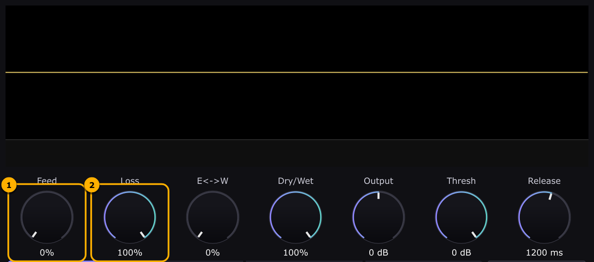

**Step 2: capture.** Turn **Loss** back to 0, so whatever goes in now stays. With sound
playing into the plugin, raise **Feed** a little (around 20–30% is plenty). The display
fills up as the incoming sound is written into the hold. The longer and louder you feed,
the more builds up.

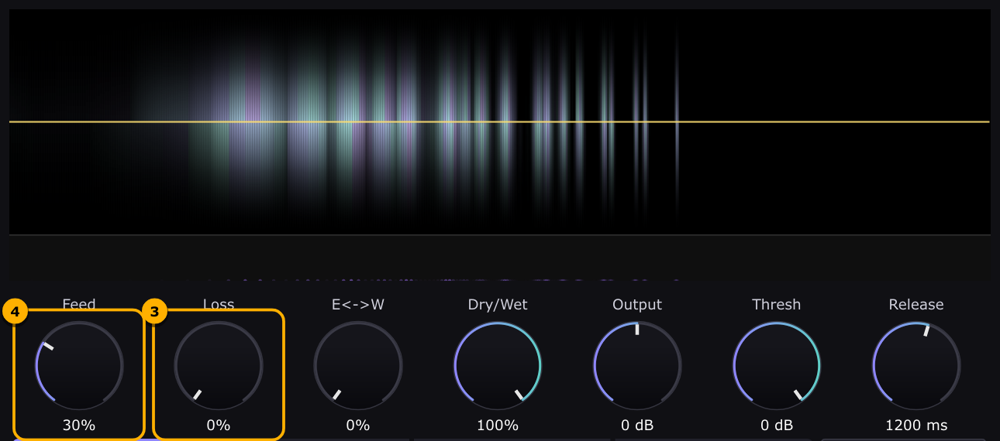

**Step 3: freeze.** Turn **Dry/Wet** to 100%, so you hear only the hold (lower it during
capture if you also want to hear the input). Then set **Feed** back to 0 and keep
**Loss** at 0. The hold is now sealed: you can stop playing and the sound keeps ringing
indefinitely, unchanged.

**Step 4: tweak the running sound.** Everything else in the plugin works on the held
sound while it rings:
- carve it with the [Shaper](#7-shaper-tab) or the [brush](#6-painting-with-the-brush)
- transpose it, spread it across the stereo field or add shimmer on the
  [Alter](#9-alter-tab) tab
- let its tones pull together on the [Harmonize](#8-harmonize-tab) tab
- put it in a room on the [Reverb](#10-reverb-tab) tab

To start over, go back to step 1.

> Feed and Loss are the two hands of the plugin. **Feed** decides how much new sound
> gets in and **Loss** decides how quickly old sound leaves. Feed 0 with Loss 0 is a
> perfect freeze. Feed up with Loss up acts like a long, smeared echo of whatever is
> playing.

---

## 2. The window at a glance

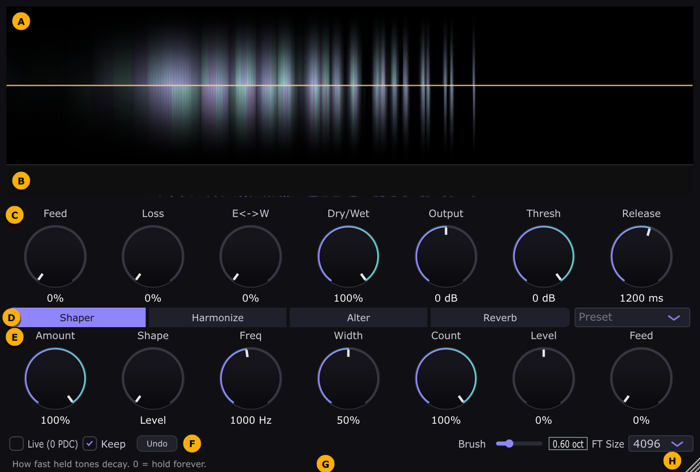

| | Area | What it is |
|---|------|------------|
| **A** | Display | The held sound, frequency by frequency. You can also paint on it (see [the brush](#6-painting-with-the-brush)). |
| **B** | Location strip | Where each held tone sits on the East–West line (see [§5](#5-eastwest-recording-in-different-places)). |
| **C** | Main row | Always visible: Feed, Loss, E↔W, Dry/Wet, Output, and the limiter. |
| **D** | Tabs + Preset | Switches the row below between Shaper, Harmonize, Alter and Reverb. The Preset menu is at the right. |
| **E** | Tab controls | The knobs for the selected tab. |
| **F** | Bottom row | Live, Keep, Undo, Brush size and FT Size. |
| **G** | Info bar | Hover over any control and a one-line explanation appears here. |
| **H** | Resize corner | Drag to scale the whole window (75%–200%). The size is remembered. |

Knobs respond to dragging up/down or left/right. Hover over a knob to see its
description in the info bar.

---

## 3. The display

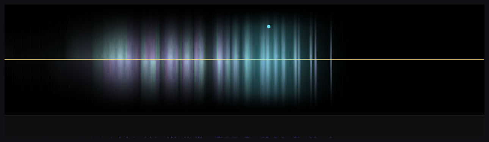

- **Left to right is pitch:** low (20 Hz) on the left, high (20 kHz) on the right, on a
  musical (logarithmic) scale, so each octave takes the same width.
- **Each held tone is a vertical line of light.** The brighter the line, the louder the
  tone. A single note shows up as a family of lines: the fundamental plus its overtones.
- **Top half is the left channel and bottom half is the right channel**, both glowing
  out from the centre line. Mono material looks symmetric. Stereo material, Spread and
  Phase Noise make the two halves differ.
- **Faint colour is phase:** a subtle purple-to-green tint. It is decoration, mostly. A
  tone with a steadily drifting tint is one that is moving.
- **Overlays:**
  - The **yellow line** is the [Shaper](#7-shaper-tab) curve. While it lies flat on the
    centre line, the shaper isn't changing anything.
  - **Cyan humps** show [Harmonize](#8-harmonize-tab) at work.
  - Both overlays stay visible whatever tab you are on, so you never forget something
    is active.
- **The location strip** (the band under the display) shows each held tone as a dot:
  - The dot's height is the tone's place on the East–West line: **East at the bottom,
    West at the top**.
  - While you record, short ticks show where input is landing. A blue tick means it is
    landing cleanly in an empty place. A red tick means it is pulling an existing tone
    over to the new position.

---

## 4. Main row: capture, hold and output

| Knob | Range (default) | What it does and when to use it |
|------|-----------------|--------------------------------|
| **Feed** | 0–100% (50%) | How much of the incoming sound is written into the hold. 0 = sealed, nothing gets in. Low values let sound fade in gently, like a slow attack. Higher values capture faster. At a steady input the held level settles near *Feed × input level*, so Feed is also a level control for what you capture. |
| **Loss** | 0–100% (20%) | How fast held tones fade away. **0 = forever.** Small values give long, slowly dying drones. Turn it all the way up to empty the hold quickly. |
| **E↔W** | 0–100% (0%) | Your position on the East–West line. See [§5](#5-eastwest-recording-in-different-places). Leave it at 0 if you don't need it. |
| **Dry/Wet** | 0–100% (100%) | Mix between the untouched input (dry) and the hold (wet). The dry signal is delayed to line up with the hold. Use 100% when the hold is the instrument, and lower it to hear the input alongside, e.g. while capturing or on an insert. |
| **Output** | −∞ to +6 dB (0 dB) | Final volume, applied before the limiter. |
| **Thresh** | −24–0 dB (0 dB) | Ceiling of the built-in limiter. Nothing goes above it. |
| **Release** | 50–5000 ms (1200 ms) | How quickly the limiter lets go after a peak. It is slow by default so the volume doesn't pump. |

**About the limiter.** A frozen sound at Loss 0 can keep building up if you keep feeding
it. The limiter makes that safe: it leaves the level alone while you are under the
threshold and pulls everything down smoothly when you go over. If the sound seems to
duck or get quieter as you add material, the limiter is working. Lower **Feed** or
**Output** instead of fighting it.

**Common recipes:**
- **Freeze:** capture with Feed up, then Feed 0, Loss 0. (See [Getting started](#1-getting-started).)
- **Infinite sustain on a live part:** Feed low (10–20%), Loss 0. Everything played
  accumulates into a growing cloud.
- **Spectral echo / smear:** Feed 50%, Loss 20–40%, Dry/Wet around 50%. The hold trails
  behind what you play and fades.
- **Clear:** Feed 0, Loss 100% for a second, then Loss back where you want it.

---

## 5. East–West: recording in different places

The hold has a second dimension besides pitch: a line running from **East** (E↔W = 0%)
to **West** (E↔W = 100%). Think of the E↔W knob as where you are standing on that line,
with a microphone and a speaker:

- **Recording:** sound that gets in through Feed is placed at your current position.
- **Listening:** every held tone is heard louder the closer you stand to it, and fades
  out as you walk away.
- **Editing:** the brush, the permanent Shaper and Harmonize affect nearby tones the
  most and distant ones hardly at all.

That lets you keep several different holds side by side and move between them. For
example, here is one chord recorded at the East end and a second, higher chord recorded
at the West end:

| E↔W at 0% (East): you hear the first chord | E↔W at 100% (West): you hear the second |
|---|---|
| 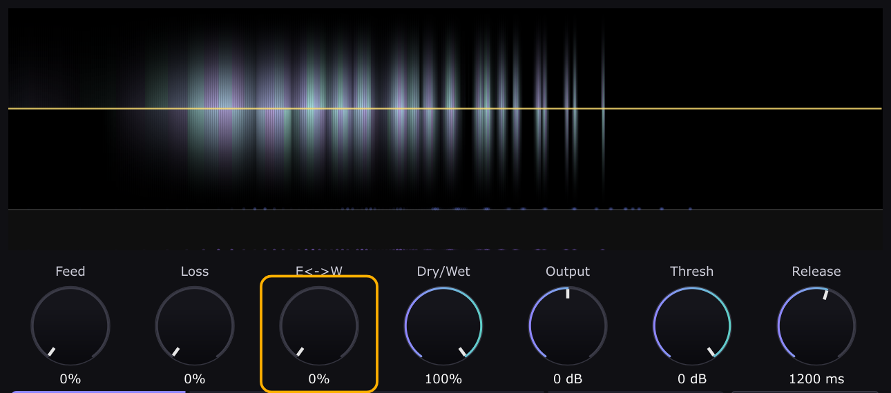 | 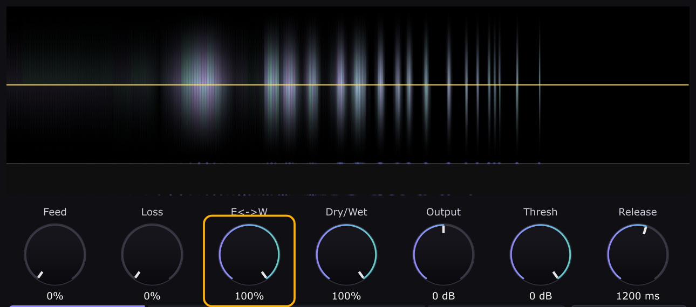 |

The location strip at the bottom of the display shows both: the dots of one chord along
the bottom (East) and the other along the top (West). Sweeping the knob between them
cross-fades smoothly.

**How to use it:**
1. Set E↔W to one spot, capture a sound (Feed up), then Feed 0.
2. Move E↔W elsewhere, play something different, capture again, then Feed 0.
3. With **Feed at 0**, sweep E↔W to walk between them without recording anything new.
   Automate it for slowly evolving textures.

The same pitch can live at up to four different places at once. If you record a pitch
right next to where it is already held, it is pulled over to the new spot instead of
being duplicated (red ticks in the strip).

---

## 6. Painting with the brush

You can edit the held sound directly by clicking on the display.

- **Above the centre line boosts and below it cuts.** The further from the centre, the
  stronger the effect.
- **Hold the button down to keep painting.** The effect builds up the longer you hold,
  even if you don't move.
- **The brush is soft.** It affects the tones near the pointer, fading out over the
  width set by the **Brush** slider in the bottom row (in octaves).
- **The pointer shows the brush:** a green-blue glow is a boost and a red glow is a cut.

| Hovering above the line (boost, nothing applied yet) | Holding below the line (cutting around 330 Hz) |
|---|---|
|  | 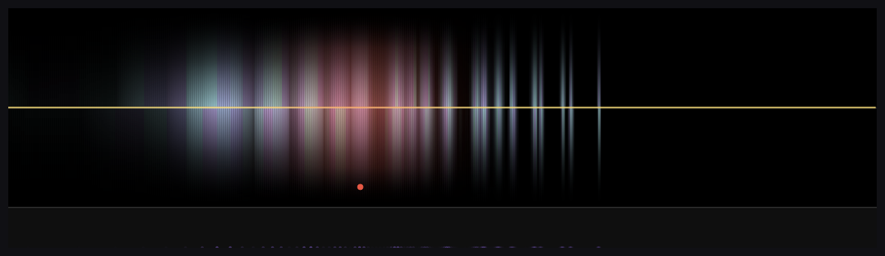 |

Brush edits change the held sound permanently, like the permanent Shaper. **Undo** in
the bottom row reverts the last stroke (it remembers the last four edits).

Uses: remove a harsh resonance, carve a gap for a vocal, bring up a buried overtone, or
"play" the spectrum by hand. A pen tablet works too, and pen pressure sets the strength.

---

## 7. Shaper tab

The Shaper applies a curve to the held sound, boosting some frequencies and cutting
others. The yellow line on the display shows the curve:
- On the centre line, a frequency is unchanged.
- Above the centre line, it is boosted.
- Below the centre line, it is cut.

| Knob | What it does |
|------|--------------|
| **Amount** | Overall depth of the shaping. 0 turns the Shaper off and the yellow line fades away. |
| **Shape** | Picks the curve type: **Level → Sigmoid → Spikes → Harmonics → Sine**. In-between positions blend two neighbouring shapes. |
| **Freq** | The centre frequency of the curve. |
| **Width** | Width, steepness or spacing. The exact meaning depends on the shape (see below). |
| **Count** | Extent or number of repeats. The exact meaning depends on the shape. |
| **Level** | Strength, positive or negative. **0 = no effect.** Flipping the sign flips which parts are boosted and which are cut. |
| **Feed** | **Momentary vs permanent** (see below). |

### The five shapes

**Level**: a compressor/expander across frequencies. Positive Level makes loud tones
louder and quiet tones quieter, so the strongest tones stand out. Negative Level evens
loud and quiet tones out. Width sets how much of the spectrum is affected around Freq
(100% = all of it). Count sets how strongly extremes are treated compared to tones near
the average. The curve looks jagged because it reacts to every tone's own level.

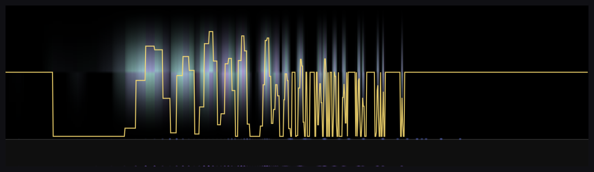

**Sigmoid**: a tilt. Positive Level brightens: it boosts above Freq and cuts below.
Negative Level darkens. Width sets how gradual the transition is.

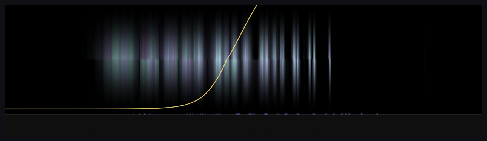

**Spikes**: an evenly spaced comb. Positive Level boosts the teeth and cuts between
them; negative Level does the reverse. Freq places the comb and Width sets the tooth
spacing.

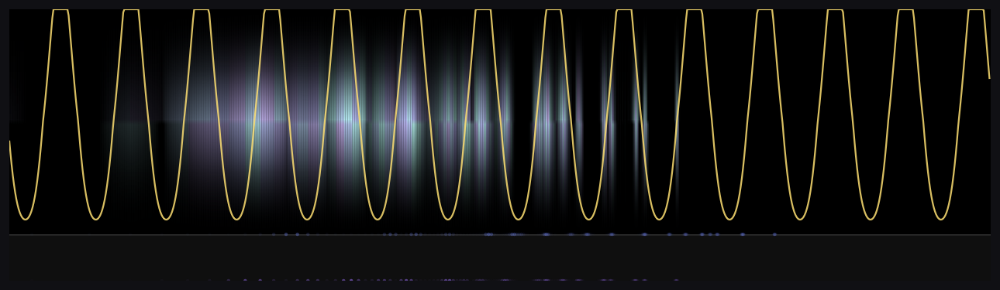

**Harmonics**: a comb that follows a harmonic series built on Freq. Set Freq to the
note you captured and positive Level reinforces its harmonics and cuts the spaces
between them, so the sound gets cleaner and more pitched (shown below, Freq = 110 Hz).
Negative Level does the reverse: it removes that note's harmonics and keeps everything
else. Width sets how wide each tooth is and Count how many harmonics are included.

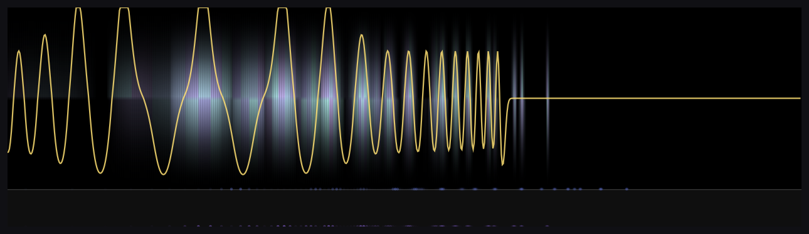

**Sine**: a smooth wave across the spectrum, a gentle multi-band EQ. Width sets how
many waves per octave and Freq shifts the pattern.

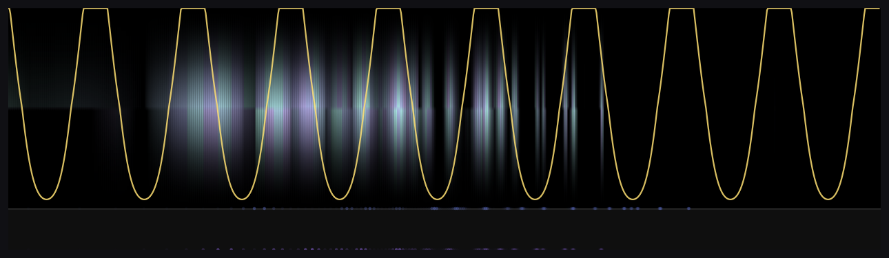

### Momentary vs permanent (the Shaper's Feed knob)

- **Feed at 0% (momentary):** the curve only changes what you *hear*. The held sound
  underneath is untouched, so setting Level back to 0 brings back the original exactly.
  Use this like an EQ you can sweep freely.
- **Feed toward 100% (permanent):** the curve is written *into* the held sound, a
  little more every moment, so the effect builds up over time. When you turn the Shaper
  off, the change stays. Use this to sculpt the hold progressively. **Undo** can revert
  to before the permanent shaping began.

Below is the same held chord after a few seconds of permanent Harmonics shaping (Level
+60%), with the Shaper switched off again. The gaps between the harmonics are now part
of the sound itself.

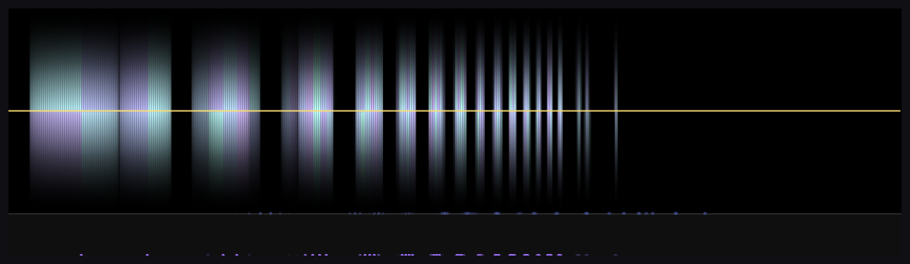

---

## 8. Harmonize tab

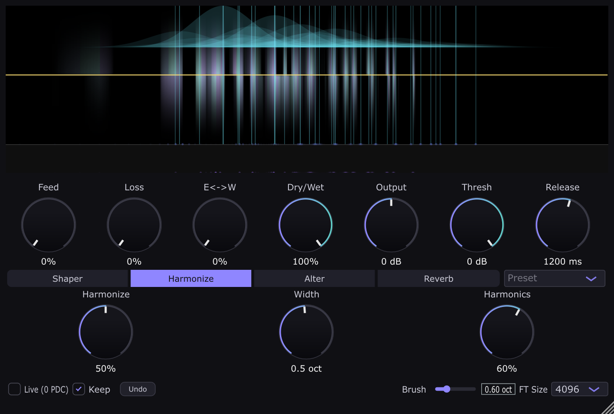

Harmonize makes held tones pull on each other's pitch, like pendulum clocks on a shared
shelf drifting into sync. The changes happen slowly and you hear them as glides. On the
display, each tone that is pulling gets a cyan hump: its height is how strongly it pulls
and its width is how far its pull reaches.

| Knob | What it does |
|------|--------------|
| **Harmonize** | Overall strength of the pull. **0 = off** (and then Harmonics does nothing either). Small values give slow drifts. Large values make the sound settle quickly. |
| **Width** | How far apart (in octaves) tones can still influence each other. Narrow means only close neighbours interact, for beating and clustering. Wide means everything pulls on everything. |
| **Harmonics** | The *kind* of pull. **0 = averaging:** tones drift toward their neighbours, so clusters merge into unisons. **1 = harmonic:** tones drift toward simple musical ratios with each other (octaves, fifths, thirds…), so dissonant material turns consonant. In between blends the two. |

**How it's meant to be used:**
- Harmonize changes the held sound itself, so the drift is permanent while **Feed is
  low**. If Feed is up, the live input keeps re-tuning the hold back to what you're
  playing.
- Freeze a dense or dissonant sound, set Harmonics toward 1 and a low Harmonize, and
  let it slowly resolve into a chord.
- With Harmonics near 0 and a narrow Width, nearby partials melt together into a
  smoother, more sine-like hold.

---

## 9. Alter tab

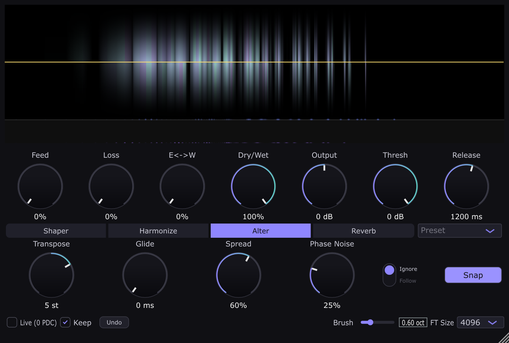

Controls you play with while the sound rings. **None of them change the held sound
itself.** They only change what you hear, so you can always return to the original.

| Control | What it does |
|---------|--------------|
| **Transpose** | Shifts the pitch of the whole hold by −12 to +12 semitones. |
| **Glide** | Portamento: pitch changes (knob moves and MIDI notes alike) slide over this time instead of jumping. 0 = instant. |
| **Spread** | Pushes each frequency slightly left or right, a different way for each, which widens a mono hold into a stereo field. Has no effect on a mono track. |
| **Phase Noise** | Shimmer: a gentle, constant random wobble on every tone. It adds life and roughness but never permanently detunes. |
| **Ignore / Follow** | Whether incoming **MIDI notes** transpose the hold. **Ignore** (default): MIDI is ignored. **Follow**: middle C (C4, note 60) = no shift, and each semitone away from it transposes by one semitone, on top of the Transpose knob. The last note played wins, and releasing it returns to the knob's pitch. |
| **Snap** | When lit, the Transpose knob jumps in whole semitones. MIDI notes are always whole semitones. |

Transpose moves the whole hold; here is the same chord at 0 and at +12 semitones (one
octave up):

| Transpose 0 | Transpose +12 |
|---|---|
| 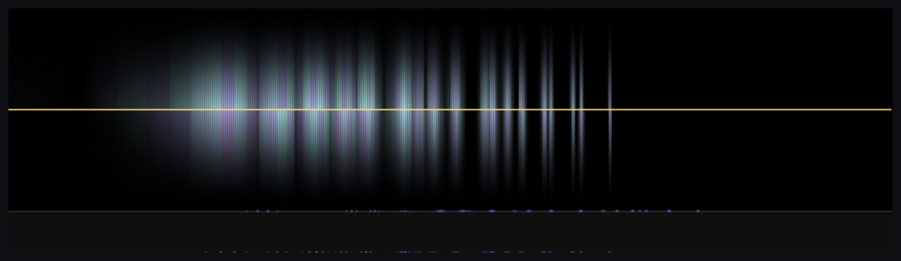 | 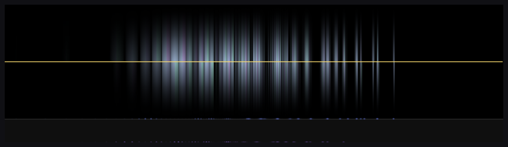 |

Spread at 100%: the left (top) and right (bottom) halves no longer match.

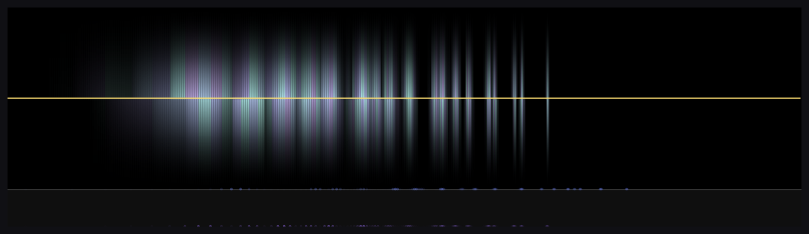

**Playing the hold from a keyboard:**
1. Freeze a sound.
2. Set the switch to **Follow** and route a MIDI track into the plugin.
3. Play the hold like an instrument: each note re-pitches the whole frozen sound.
4. Add **Glide** for slides between notes.

---

## 10. Reverb tab

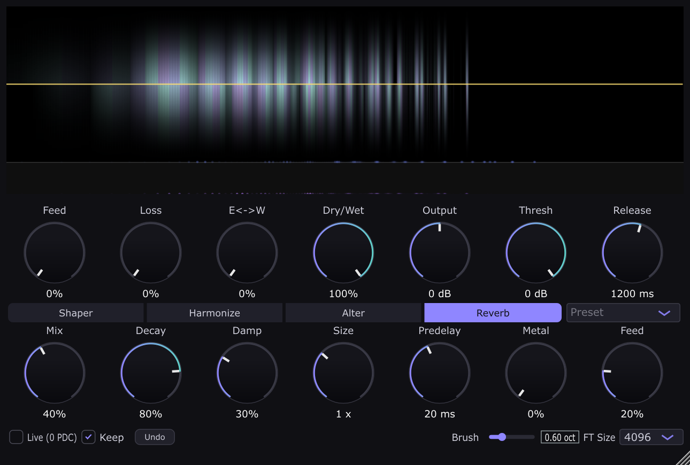

A plate reverb after the hold. It is useful on its own for space, and also as a source
of new material for the hold.

| Knob | What it does |
|------|--------------|
| **Mix** | Amount of reverb. **0 = reverb completely off.** |
| **Decay** | Length of the tail. |
| **Damp** | Darkens the tail: high frequencies die away faster. |
| **Size** | Room size. Moving it while sound is ringing bends the tail's pitch slightly, which is a usable effect. |
| **Predelay** | Gap before the reverb starts (0–250 ms). |
| **Metal** | Trades smooth diffusion for a harder, more metallic ring. |
| **Feed** | Sends the reverb tail **back into the hold**. This works even when the main Feed is at 0. |

**Reverb Feed** is the creative one. The reverb smears the held sound, the smear is
captured into the hold, and that gets reverberated again. Over time the hold blooms
into a denser, more diffuse texture. It is kept in check automatically, so even Feed
100% with Loss 0 settles instead of exploding. Start low (10–20%) and listen to it
grow. Raise **Loss** a little if you want it to evolve without piling up.

---

## 11. Bottom row

| Control | What it does |
|---------|--------------|
| **Live (0 PDC)** | The plugin needs a short look-ahead (its latency, about 85 ms at FT Size 4096 / 48 kHz) and normally tells the host, which delays the other tracks to keep everything in sync. Turn **Live** on when you're playing through it live and want the host to stop that compensation. The hold still lags the input a little, but nothing else gets delayed. |
| **Keep** | On (default): the held sound is saved inside your project and is still ringing when you reopen it. Off: the plugin reopens silent. Keeping adds roughly 0.1–0.5 MB to the project. |
| **Undo** | Reverts the held sound to before the last brush stroke or the last time the permanent Shaper was engaged. Remembers up to four steps. It doesn't undo knob moves, Harmonize drift or normal capturing. |
| **Brush** | Width of the [brush](#6-painting-with-the-brush), in octaves. |
| **FT Size** | The analysis size: 1024, 2048, 4096 (default) or 8192. See below. **Changing it clears the hold.** |
| **Preset** (next to the tabs) | Loads a starting point: resets all knobs, then applies the preset. Moving any knob afterwards deselects it. The current presets are rough sketches that haven't been tuned by ear yet. Presets never touch the held sound. |

### FT Size: pitch detail vs time detail

Larger sizes separate close frequencies better: individual partials become sharp lines
and the hold sounds smoother and purer. They also respond more slowly, so transients
blur and latency goes up. Smaller sizes react faster and keep more of the input's
grit, at the cost of a blurrier, more "phasey" spectrum.

| 1024: fast, blurry | 8192: slow, very precise |
|---|---|
| 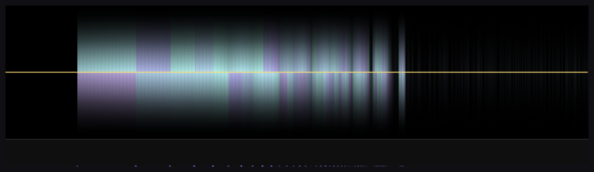 | 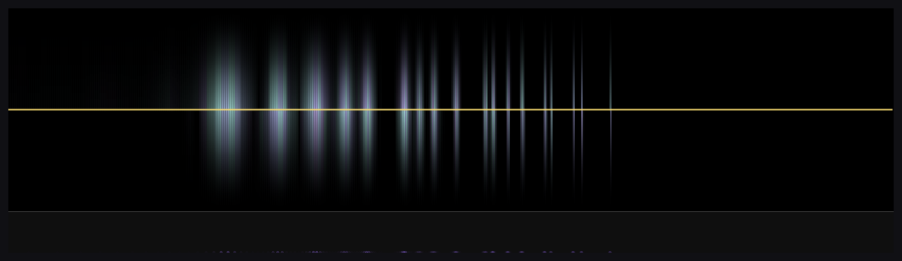 |

4096 is a good default for most material. Try 8192 for pads and drones, and 1024–2048
for percussive or rhythmic sources.

---

## 12. Tips and troubleshooting

- **No sound?** Check that the hold isn't empty: the display shows nothing. Then raise
  Feed while sound plays in. Also check that Loss isn't at 100%, Dry/Wet isn't at 0%,
  Output isn't all the way down, and the Shaper Level isn't cutting everything.
- **It keeps getting louder, then ducks.** With Loss at 0 and Feed up, energy keeps
  accumulating and the limiter holds it back. Lower Feed, add a little Loss, or freeze
  (Feed 0).
- **The hold drifts or changes by itself.** Something that edits the hold is active:
  Harmonize, the Shaper's Feed knob above 0, or the Reverb's Feed. Turn those to 0 for
  a perfectly static freeze.
- **The brush or Shaper seems to do nothing.** Check E↔W: edits affect tones near your
  current position most. If the tones were recorded far away, walk over to them first.
  Also check that there is actually something held at that frequency.
- **The pitch jumps when MIDI plays.** The Alter tab switch is on **Follow**. Set it to
  **Ignore**.
- **It sounds different after reopening the project.** If **Keep** was off, the hold
  wasn't saved. Changing **FT Size** also clears the hold.
- **Automation:** every knob is automatable. FT Size, Live, Keep, Brush size and the
  selected tab are window settings saved with the project, not automatable parameters.
